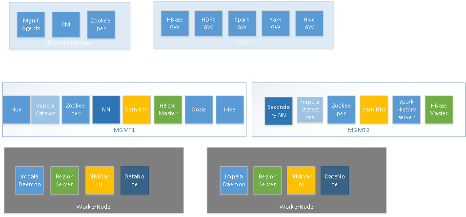

# Cloudera CDH Setup #

* [Purpose](#purpose)
* [Overview](#overview)
  * [Hadoop Services](#hadoop-services)
  * [Host roles](#host-roles)
* [Creating vs Expanding](#creating-vs-expanding)
* [Configuration Files](#configuration-files)
* [Usage](#usage)

## Purpose ##

[cm_setup](cm_setup.py) is a python script that drives the [Cloudera Manager API](http://cloudera.github.io/cm_api/apidocs/v10/) to install Hadoop services across a set of ready-provisioned hosts. Two great advantages of using a script in this way are consistent assignment of roles to hosts, and consistent configuration of those services.

It is assumed that some hosts exist with key-based ssh access configured and Cloudera Manager installed on one of those hosts.

## Overview ##

This section describes the make-up of the Hadoop cluster that is created and a brief description of the various services. The description here applies to the "standard" flavour intended for PoC usage.

### Hadoop Services

#### HDFS
[HDFS](http://hadoop.apache.org/) is a distributed file system, providing a virtual file sysem of directories and files actually stored on multiple hosts.
#### HBase
[HBase](https://hbase.apache.org/) is a key-value database, which uses HDFS for persistence.
#### Hive
[Hive](https://hive.apache.org/) provides a store of metadata, used to map HDFS and HBase data sources into SQL queryable datasets.
#### Impala
[Impala](http://impala.io/) enables distributed parallel compute of SQL queries against data in HDFS or HBase.
#### Hue
[Hue](http://gethue.com/) hosts many differnt user-friendly management interfaces on HDFS, HBase, Yarn, Oozie and others.
#### Oozie
[Oozie](https://oozie.apache.org/) runs batch processing jobs on a schedule. PNDA applications can include Oozie components.
#### Spark_on_yarn
Spark On Yarn just provides history for completed Spark and spark Streaming jobs.
#### Yarn
[Yarn](http://hadoop.apache.org/) runs computation jobs and allocates the compute resources of the cluster to these jobs. PNDA applications can include Oozie (batch) or Spark Streaming (real-time) components that both run on Yarn.
#### Zookeeper
[Zookeeper](https://zookeeper.apache.org/) is used by Hbase to coordinate such things as which node is the active master.

[Jupyter](http://jupyter.org/) and [OpenTSDB](http://opentsdb.net/) are installed separately on other hosts in the PNDA cluster and not managed through Cloudera Manager.

### Host roles

#### Edge node
The edge node contains client configuration so that command line tools can be run from this node against the cluster without allowing routine access to other hosts. Routine ssh access to nodes other than the edge node should be discouraged because of the chance to break things with a stray rm -rf.
#### Cloudera Manager node
The Cloudera Manager node runs Cloudera Manager and a Zookeeper.
#### Management nodes 1 & 2
The two management nodes run HDFS namenode, HBase master, Hive metastore, Hue, Impala catalog and statestore, Oozie, Yarn resource manager and jobhistory, Zookeeper and Spark history.
#### Data nodes
Datenodes run the HDFS datanode, HBase regionserver, Impala Daemon and Yarn nodemanager. The number of datanodes can be chosen according to the anticipated storage and compute requirements.

## Creating vs Expanding ##
If any of the set of hosts supplied to the script are already part of a cluster known to the Cloudera Manager then any new hosts will be added to that cluster, and any removed hosts deleted from the cluster. When expanding a cluster, the affected services are restarted. This could be an area for further work, as it should be possible to add hosts without restarting.

If the hosts are entirely new and not part of any existing cluster then a new cluster is created, using the entire set of hosts.

## Configuration Files ##
Files starting cfg_<flavour> contain role -> host mappings and configuration blocks for a particular flavour of cluster.

The "roles" array specifies role "type" (values as defined by Cloudera Manager), to install on hosts of type "target" (as specified in the list of hosts supplied to cm_setup).

The "config" object is used to set the role configuration. A good way of determining the values to use here, is to manually set an option via the Cloudera Manager web interface, and then inspect /api/v6/cm/deployment to reverse engineer the setting names and values.

## Usage ##
cm_setup is called automatically by the PNDA provisioning scripts and provides only one function - setup_hadoop().

The parameters to setup_hadoop() are:
- cm_api: ip address of Cloudera Manager
- user: username to ssh to each host
- nodes: details of the hosts to use (see below)
- key_name: file name of a private key file that can be used (without passphrase) to access each host. This should be placed in the same directory as cm_setup.py.
- cluster_name: name of the cluster to create
- flavour: determines which cfg file to use (see Configuration Files)

Nodes must be an array with each object containing:
- type: Used to define assignment of roles to hosts: EDGE, CM, MGR01, MGR02, DATANODE.
- private_addr: private ip address of the node
- public_addr: public ip address of the node. This allows cm_setup to run locally, if only private addresses are available then public_addr can be set to the private IP but cm_setup must then run from a host on that network.

